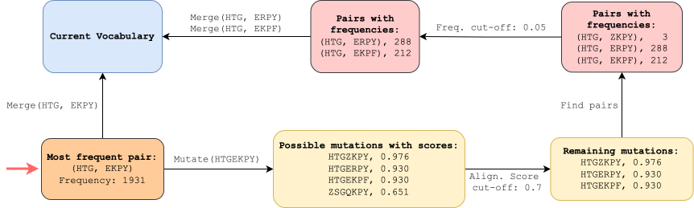

<h1 align="center"> PUMA: Discovery of Protein Units via Mutation-Aware Merging </h1>

</br>

<center></center>

</br></br></br>

<center></center>

</br>

This repo contains all data and source code used during [this work](https://www.arxiv.org/abs/2503.08838).
We provide codes and notebooks to reproduce our work.

- **[Prog](Prog)** contains codes and notebooks.
  - **[Prog/helper_classes.py](Prog/helper_classes.py):** Data Structures of PUMA.
  - **[Prog/bpe_functions.py](Prog/bpe_functions.py):** Training functions of PUMA.
  - **[Prog/multiprocess_training.py](Prog/multiprocess_training.py):** The main script to train tokenizers. Utilizes multiprocessing.
  - **[Prog/vocabulary_functions.py](Prog/vocabulary_functions.py):** Useful functions related to vocabulary manipulation.
  - **[Prog/dataset_schema.ipynb](Prog/dataset_schema.ipynb)** covers where we obtained all the data and how we processed them to be utilized for our study.
  - **[Prog/general_tokenizer_statistics.ipynb](Prog/general_tokenizer_statistics.ipynb):** Preliminary Analysis - General Tokenizer Statistics.
  - **[Prog/effect_of_substitution_matrices.ipynb](Prog/effect_of_substitution_matrices.ipynb):** Preliminary Analysis - Effect of Substitution Matrices.
  - **[Prog/experiment_esm_mutation_vs_alternative.ipynb](Prog/experiment_esm_mutation_vs_alternative.ipynb):** Experiments - Main Notebook - Protein Language Models Contextually Prefer PUMA Siblings
    - **[Prog/experiment_esm_functions.py](Prog/experiment_esm_functions.py):** Experiments - Helper Functions - Protein Language Models Contextually Prefer PUMA Siblings
  - **[Prog/experiment_go_topic_model.ipynb](Prog/experiment_go_topic_model.ipynb):** Experiments - Main Notebook - PUMA Genealogy Improves Functional Representation via Topic Modeling
    - **[Prog/experiment_go_functions.py](Prog/experiment_go_functions.py):** Experiments - Helper Functions - PUMA Genealogy Improves Functional Representation via Topic Modeling
- **[RSRC/vocabs](RSRC/vocabs)** contains internal and huggingface versions of BPE and PUMA vocabulary files for the vocabulary size of 6400.
- **[RSRC/dataset](RSRC/dataset)** contains standard and pre-tokenized versions of the UniRef50 human taxanomy proteins. Codes that create fasta files can be found in [Prog/dataset_schema.ipynb](Prog/dataset_schema.ipynb) notebook's 'Generate Fasta Files' section.
  - **[RSRC/dataset/uniref_50.fasta](RSRC/dataset/uniref_50.fasta):** Standard versions of the proteins.
    ```
    format:
    >uniprot_id
    protein sequence

    example:
    >A0A087WZT3
    MELSAEYLREKLQRDLEAEHVLPSPGGVGQVRGETAASETQLGS
    ```

## Abstract

Proteins are the essential drivers of biological processes. At the molecular level, they are chains of amino acids that can be viewed through a linguistic lens where the twenty standard residues serve as an alphabet combining to form a complex language, referred to as the language of life. To understand this language, we must first identify its fundamental units. Analogous to words, these units are hypothesized to represent an intermediate layer between single residues and larger domains. Crucially, just as protein diversity arises from evolution, these units should inherently reflect evolutionary relationships. We introduce PUMA (Protein Units via Mutation-Aware Merging) to discover these evolutionarily meaningful units. PUMA employs an iterative merging algorithm guided by substitution matrices to identify protein units and organize them into families linked by plausible mutations. This process creates a hierarchical genealogy where parent units and their mutational variants coexist, simultaneously producing a unit vocabulary and the genealogical structure connecting them. We validate that PUMA families are biologically meaningful; mutations within a PUMA family correlate with clinically benign variants and with high-scoring mutations in high-throughput assays. Furthermore, these units align with the contextual preferences of protein language models and map to known functional annotations. PUMA’s genealogical framework provides evolutionarily grounded units, offering a structured approach for understanding the language of life.

If you use this repository, please cite the following related [paper]():
```bibtex
@article{suyunu2025evobpe,
  title={evoBPE: Evolutionary Protein Sequence Tokenization},
  author={Suyunu, Burak and Dolu, {\"O}zdeniz and {\"O}zg{\"u}r, Arzucan},
  journal={arXiv preprint arXiv:2503.08838},
  year={2025}
}
```

## License

The data in this repository is released under terms of the [CC-BY-4.0](https://creativecommons.org/licenses/by/4.0/). See [LICENSE](LICENSE.txt) for details.

This code base is licensed under the MIT license. See [MIT-LICENSE](MIT-LICENSE.txt) for details.
